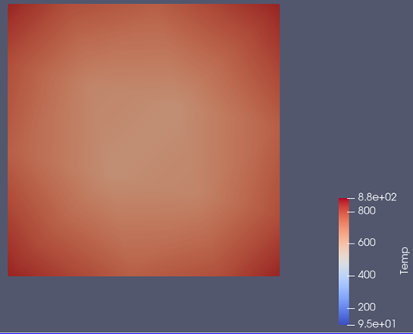

# Finite Element Method for Non-Stationary Heat Transfer

## Introduction

The Finite Element Method (FEM) is a computational technique used in engineering and sciences to approximate solutions for complex physical and structural problems. By breaking down a large system into smaller, manageable finite elements and using mathematical equations, FEM handles stress, deformation, flow, and other physical phenomena across various fields including mechanical, civil, and biomedical engineering, as well as aerodynamics. This project specifically deals with the simulation of **non-stationary heat transfer in two-dimensional objects.**

## Model Description

The program simulates non-stationary heat exchange on two-dimensional objects, considering boundary conditions. The area under study is divided by a mesh into finite elements shaped as arbitrary quadrilaterals. Nodes define the edges of elements and hold specific coordinates. The temperature at each node is calculated at defined time steps throughout the simulation. The simulation parameters include total simulation time, time step, thermal conductivity coefficient, heat exchange coefficients, initial and ambient temperatures, material density, and specific heat, all provided in text files.

### Fundamental Equations

1. Fourier's law for non-stationary processes:
   \[
   div(k(t) \cdot grad(t) + Q) = c_p \frac{\partial}{\partial \tau}
   \]
2. Combined boundary condition of convection and radiation, generalized to a single boundary condition:
   \[
   k(t)(\frac{\partial t}{\partial x} a_x + \frac{\partial t}{\partial y} a_y) = \sigma (t - t_\infty)
   \]
3. Temperature inside an element represented as a function of nodal values:
   \[
   t = \sum_{i=1}^{n} N_i t_i = {N}^T {t}
   \]

### Classes and Their Roles

- `Matrix`: Manages common matrix and vector operations used throughout the code.
- `node`: Represents a single node in the mesh with coordinates and boundary condition status.
- `element`: Handles finite element definitions including node indexing.
- `gaussNode` and `gaussNode2D`: Represent Gauss integration points necessary for numerical integration.
- `globalData`: Holds all global parameters of the process, reads from files, calculates global matrices `[H]`, `[C]`, and vector `{P}`, and manages simulation steps.

- `finiteElement`: Represents a specific finite element, calculating local matrices and integrating them into global matrices.
- `calcPoints`: Automatically initializes Gauss integration points in a predefined order, simplifying iteration in the code.

### Key Functions

- `calculateA()`, `calculateB()`: Calculate matrices required for solving the system of equations.
- `calculateSolution()`: Iteratively solves the system of equations, updating temperatures at each time step and generating output files compatible with ParaView for visualization.

## Output and Visualization

The simulation generates `.vtk` files, which are suitable for use with the free graphical postprocessor **ParaView**. This tool assists in visualizing the results by providing detailed insights into temperature distribution over time across the modeled area. Example output files can be found in the `output` directory.

Exaple Paraview visualisation of temepature distribution on a square plate.

